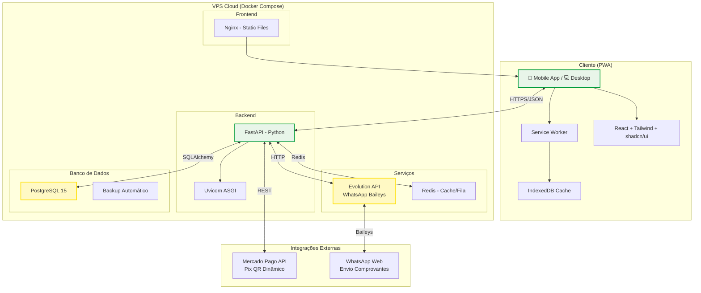
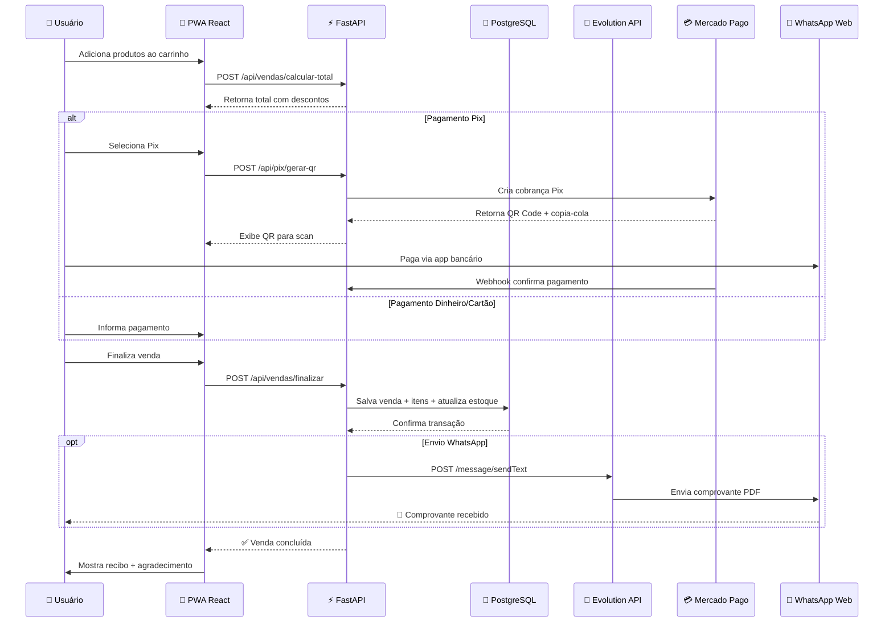
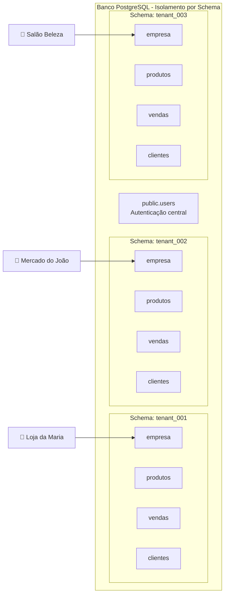

# 🟢🟡 Mechama PDV - Arquitetura do Sistema

## Diagrama de Arquitetura

## Fluxo de Dados - Venda Completa

## Estrutura Multi-Tenant

## Stack Tecnológico

| Camada | Tecnologia | Versão | Propósito |
|--------|-----------|--------|-----------|
| **Frontend** | React | 18+ | UI interativa |
| | TypeScript | 5+ | Tipagem segura |
| | Vite | 5+ | Build rápido |
| | Tailwind CSS | 3.4+ | Estilos utilitários |
| | shadcn/ui | latest | Componentes UI |
| | PWA | - | Offline capability |
| | Zustand | - | State management |
| **Backend** | Python | 3.11+ | Linguagem principal |
| | FastAPI | 0.104+ | API REST |
| | SQLAlchemy | 2+ | ORM |
| | Pydantic | 2+ | Validação dados |
| | Celery | - | Tarefas assíncronas |
| **Banco** | PostgreSQL | 15+ | Dados persistentes |
| | Redis | 7+ | Cache e filas |
| **WhatsApp** | Evolution API | latest | Baileys-based |
| **Pix** | Mercado Pago | API v1 | QR dinâmico |
| **Deploy** | Docker | 24+ | Containerização |
| | Nginx | latest | Reverse proxy |

## Segurança

- 🔐 JWT tokens com refresh
- 🔒 HTTPS obrigatório (Let's Encrypt)
- 🛡️ Rate limiting por tenant
- 📝 Audit logs de vendas
- 💾 Backup criptografado diário

## Escalabilidade

- Horizontal: múltiplas replicas FastAPI
- Vertical: upgrade VPS conforme crescimento
- Cache Redis para produtos frequentes
- CDN para imagens (Cloudflare R2 gratuito)
